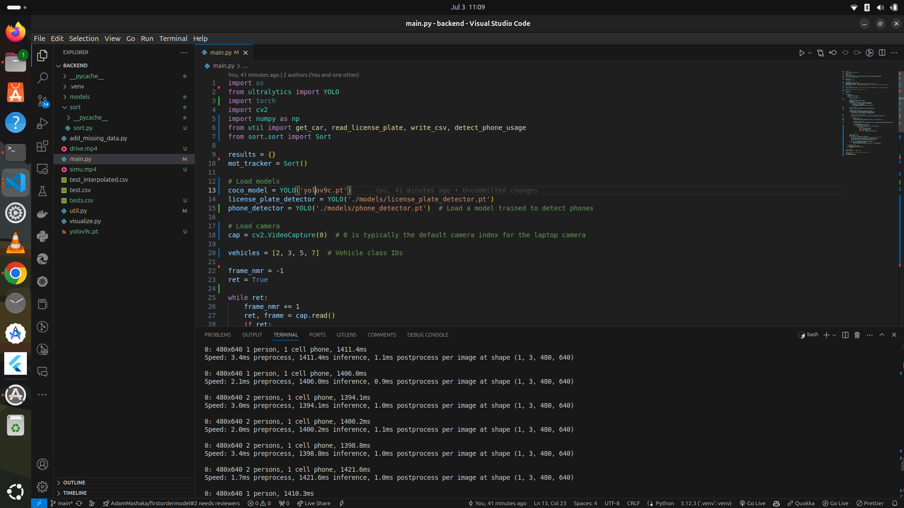

# Object Detection (Driver use Phone)-

Intro
--------
This repo will help you get started on how you can get started woth how to control driver who they use phone at the time they drive, it was FYP that presented by madam shey and done by M y sely Adam what i use **Deep learning** and **Image to text** in one application


Full article
------------
The full article for this source code can be found on [my blog](adamportifolio.netlify.app) on an article named [How to convert image to text in Python ](


Getting started 
-----------------
In order to use this code, firstly clone the repo using **git** or download the zip file manually

```bash
$-> git clone https://github.com/AdamMashaka/detector-FYP_shey-
$->cd detector-FYP_shey-
$ run server--> python3 main.py
```

Dependancies 
-------------
In order to run this code you're supposed to have **ultralytics** and **numpy** libary installed
on your machine, you can just use *pip* command to this.

```bash
-> pip install ultralytics
-> pip install numpy
```

**Note**: Installing those dependance you can find them in my requirement.txt
.


How to run 
------------
By default the script will load a camera with help of  **open cv** from its current directory
to change it adjust my code script in main.py.



Explore it 
-----------
Now keep explore it by testing it with various input picture to see what kinda of sound it produces 

Give it a star 
--------------
Did you find this information useful, then give it a star so as people can able to see it 


Credits
-----------
All the credits to [Adam](github.com/AdamMashaka)
